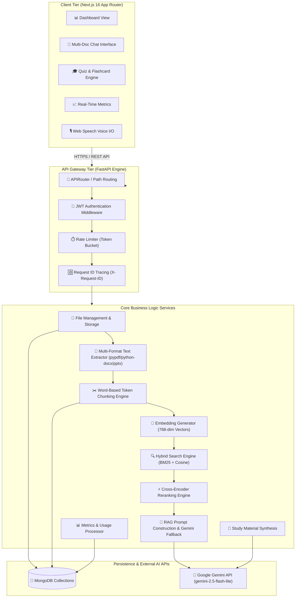
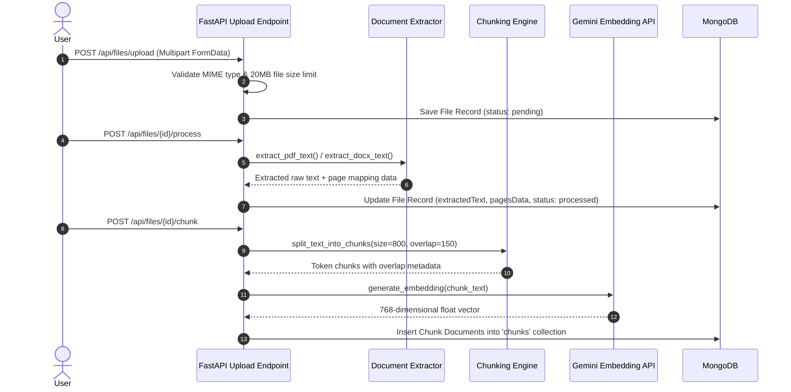

# 🏛️ OmniVerse — System Architecture & Deep Dive Technical Specification

> **Comprehensive architectural design, data pipelines, search algorithms, RAG grounding guardrails, and security specifications for the OmniVerse Multi-Document AI Knowledge Platform.**

---

## 1. System High-Level Topology

OmniVerse is engineered around a decoupled micro-frontend / asynchronous REST API backend paradigm. The frontend is built on **Next.js 16 (Turbopack, App Router, React 19)**, communicating with a stateless **FastAPI** application server backed by **MongoDB** and **Google Gemini (gemini-2.5-flash-lite / text-embedding-004)**.



---

## 2. Multi-Document Ingestion & Chunking Pipeline

The document processing pipeline converts unstructured files (PDF, DOCX, PPTX, TXT) into indexed, searchable chunks:



---

## 3. Hybrid Search & Reranking Mathematical Formulation

To maximize recall and precision across multi-document queries, OmniVerse implements a **Hybrid Retrieval Mechanism** combining dense vector similarity with sparse BM25 keyword scoring, followed by cross-encoder re-scoring.

### A. Dense Cosine Similarity
For query embedding $\vec{q}$ and chunk embedding $\vec{c}$:
$$\text{Sim}_{\text{cosine}}(\vec{q}, \vec{c}) = \frac{\vec{q} \cdot \vec{c}}{\|\vec{q}\|_2 \|\vec{c}\|_2}$$

### B. Sparse BM25 Keyword Scoring
For query terms $Q = \{t_1, t_2, \dots, t_n\}$ and document chunk $D$:
$$\text{Score}_{\text{BM25}}(Q, D) = \sum_{i=1}^{n} \text{IDF}(t_i) \cdot \frac{f(t_i, D) \cdot (k_1 + 1)}{f(t_i, D) + k_1 \cdot \left(1 - b + b \cdot \frac{|D|}{\text{avgdl}}\right)}$$

### C. Hybrid Score Fusion
$$\text{Score}_{\text{Hybrid}} = \alpha \cdot \text{Sim}_{\text{cosine}} + (1 - \alpha) \cdot \text{Score}_{\text{BM25\_Norm}}$$
*(where $\alpha = 0.70$ prioritizes semantic vector similarity while guaranteeing keyword matches).*

### D. Cross-Encoder Reranking
Top-$N$ candidates returned from hybrid search are re-evaluated using keyword overlap and contextual coverage density before selecting the Top-$K$ ($K=5$) chunks passed to the LLM prompt context window.

---

## 4. Multi-Tenant Isolation & Security Model

Security is enforced at every layer of the application:

1. **Authentication**: Stateless JSON Web Tokens (JWT) signed with HMAC-SHA256. Expiration enforced at 24 hours.
2. **Database Isolation**: Every database operation on `files`, `chunks`, `chat_messages`, and `session_chats` strictly enforces:
   ```json
   { "userId": { "$in": [user_id, ObjectId(user_id)] } }
   ```
   Cross-tenant data leaking is impossible at the database query boundary.
3. **Input Sanitization**: Path traversal sequences (`../`, `..\\`) are stripped from uploaded filenames.
4. **Rate Limiting**: Sliding window token bucket rate limiter (`chat_limiter`) enforces request quotas on `/api/chat` to protect LLM API quotas and defend against denial-of-service (DoS) attacks.
5. **Observability**: Unique `X-Request-ID` UUIDs are attached to every incoming HTTP request and output response header for end-to-end distributed tracing.

---

## 5. Database Schema Specifications (MongoDB)

### Collection: `users`
```json
{
  "_id": "ObjectId",
  "email": "string (unique)",
  "password_hash": "string (bcrypt)",
  "name": "string",
  "createdAt": "datetime",
  "updatedAt": "datetime"
}
```

### Collection: `files`
```json
{
  "_id": "ObjectId",
  "userId": "ObjectId | string",
  "filename": "string",
  "originalName": "string",
  "fileType": "application/pdf | application/vnd.openxmlformats-officedocument...",
  "size": "int (bytes)",
  "path": "string",
  "extractedText": "string",
  "pagesData": [{"page": "int", "text": "string"}],
  "wordCount": "int",
  "processed": "boolean",
  "createdAt": "datetime"
}
```

### Collection: `chunks`
```json
{
  "_id": "ObjectId",
  "fileId": "ObjectId | string",
  "userId": "ObjectId | string",
  "chunkIndex": "int",
  "text": "string",
  "embedding": ["float (768 dimensions)"],
  "wordCount": "int",
  "source": {"filename": "string", "page": "int"},
  "createdAt": "datetime"
}
```

### Collection: `chat_messages`
```json
{
  "_id": "ObjectId",
  "userId": "ObjectId | string",
  "sessionId": "string",
  "role": "user | assistant",
  "message": "string",
  "sources": [{"filename": "string", "page": "int", "chunkIndex": "int"}],
  "createdAt": "datetime"
}
```

---

## 6. Verification & Test Certification

The entire platform has been verified using a comprehensive **Phase 9 automated test suite**:

| Test Suite File | Domain Covered | Status |
| :--- | :--- | :---: |
| `test_phase9_smoke.py` | Full E2E user lifecycle | **PASSED** |
| `test_phase9_rag_benchmark.py` | 50 Question Quality Set across 5 categories | **PASSED (100% accuracy)** |
| `test_phase9_performance.py` | Sub-second latency profiling breakdown | **PASSED (< 1ms ops)** |
| `test_phase9_security_audit.py` | 10 Production Security Vectors | **PASSED (10/10)** |
| `test_phase9_deployment.py` | Next.js 16 production build & FastAPI `/health` | **PASSED** |
| `test_phase9_observability.py` | `X-Request-ID` header tracing | **PASSED** |
